## Table of Contents

- [1 Einleitung](#einleitung)
    * [1.1 Ziele](#ziele)
    * [1.2 Zielgruppe](#zielgruppe)
    * [1.3 Übungsmaterialien und didaktisches Konzept](#übungsmaterialien-und-didaktisches-konzept)
- [2 Annotation als Arbeitsphase in einem Forschungsprojekt](#annotation-als-arbeitsphase-in-einem-forschungsprojekt)
    * [2.1 Beispiel 1: Häufigkeit bestimmter Wortarten](#beispiel-1:-häufigkeit-bestimmter-wortarten)
    * [2.2 Beispiel 2: Zuordnung von Eigenschaften zu Figuren](#beispiel-2:-zuordnung-von-eigenschaften-zu-figuren)
    * [2.3 Workflow Annotation in einem Forschungsprojekt ](#workflow-annotation-in-einem-forschungsprojekt-)
- [3 Annotation in den Geisteswissenschaften](#annotation-in-den-geisteswissenschaften)
    * [3.1 Annotation: Anreicherung mit Zusatzinformation](#annotation:-anreicherung-mit-zusatzinformation)
    * [3.2 Annotation: Anwendung vs. Erstellung eines Kategoriensystems](#annotation:-anwendung-vs.-erstellung-eines-kategoriensystems)
        + [3.2.1 Kategorienbildung durch Annotation](#kategorienbildung-durch-annotation)
            - [3.2.1.1 Beispiel: "Heuristische Textpraktiken in den Wissenschaften" (Bender & Müller 2020)](#beispiel:-"heuristische-textpraktiken-in-den-wissenschaften"-(bender-&-müller-2020))
        + [3.2.2 Kategorisierung durch Annotation](#kategorisierung-durch-annotation)
            - [3.2.2.1 Beispiel: "'The question is, how cruel is it?' Keywords, Foxhunting and the House of Commons" (Baker 2006)](#beispiel:-"'the-question-is,-how-cruel-is-it?'-keywords,-foxhunting-and-the-house-of-commons"-(baker-2006))
- [4 Annotationsarten und -werkzeuge](#annotationsarten-und--werkzeuge)
    * [4.1 Editionsphilologische Annotation für Text, Bild, Noten: Metadaten, Struktur, Klassifizierung](#editionsphilologische-annotation-für-text,-bild,-noten:-metadaten,-struktur,-klassifizierung)
        + [4.1.1 Forschungsinteressen](#forschungsinteressen)
            - [4.1.1.1 Edition neuerer Texte](#edition-neuerer-texte)
            - [4.1.1.2 Edition älterer Texte](#edition-älterer-texte)
            - [4.1.1.3 Edition musikalischer Werke](#edition-musikalischer-werke)
        + [4.1.2 Werkzeuge](#werkzeuge)
            - [4.1.2.1 TextGrid-Lab (Neuroth 2015)](#textgrid-lab-(neuroth-2015))
            - [4.1.2.2 MEI Score Editor: Noten-Editor](#mei-score-editor:-noten-editor)
    * [4.2 Audio- und Video-Annotation](#audio--und-video-annotation)
        + [4.2.1 Forschungsinteressen](#forschungsinteressen)
        + [4.2.2 Ressourcen und Werkzeuge](#ressourcen-und-werkzeuge)
            - [4.2.2.1 Datenbank für gesprochenes Deutsch (DGD) (IDS Mannheim 2014)](#datenbank-für-gesprochenes-deutsch-(dgd)-(ids-mannheim-2014))
            - [4.2.2.2 TalkBank (MacWhinney & Wagner 2010)](#talkbank-(macwhinney-&-wagner-2010))
            - [4.2.2.3 EXMARaLDA: Audio- und Videoannotation (Schmidt 2004)](#exmaralda:-audio--und-videoannotation-(schmidt-2004))
            - [4.2.2.4 elan (Eudico Linguistik Annotator): Videoannotation (Wittenburg u. a. 2006)](#elan-(eudico-linguistik-annotator):-videoannotation-(wittenburg-u.-a.-2006))
    * [4.3 Automatische Text-Annotation auf Satz- und Wortebene](#automatische-text-annotation-auf-satz--und-wortebene)
        + [4.3.1 Forschungsinteressen](#forschungsinteressen)
        + [4.3.2 Werkzeuge](#werkzeuge)
            - [4.3.2.1 Language Resource Switchboard: Suchmaschine für Textwerkzeuge](#language-resource-switchboard:-suchmaschine-für-textwerkzeuge)
            - [4.3.2.2 Linguistische Mehrebenen-Annotation und Visualisierung mit WebLicht (Hinrichs u. a. 2010)](#linguistische-mehrebenen-annotation-und-visualisierung-mit-weblicht-(hinrichs-u.-a.-2010))
    * [4.4 Manuelle Text-Annotation auf Satz- und Wortebene](#manuelle-text-annotation-auf-satz--und-wortebene)
        + [4.4.1 Forschungsinteressen](#forschungsinteressen)
        + [4.4.2 Werkzeuge](#werkzeuge)
            - [4.4.2.1 WebAnno (Eckart de Castilho u.a. 2016)](#webanno-(eckart-de-castilho-u.-a.-2016))
            - [4.4.2.2 Catma (Gius u.a. 2020)](#catma-(gius-u.-a.-2020))
- [5 Literatur](#literatur)

# Lehrpfad Annotation

# 1 Einleitung

## 1.1 Ziele

Dieser Lehrpfad führt in Annotation als zentrale Methode der digitalen Geisteswissenschaften ein (s.
Abschnitt [3](#bookmark=id.giqoczyu51sv)) und stellt die wichtigsten Annotationsarten und eine Auswahl der dafür zur
Verfügung stehenden digitalen Werkzeuge vor (s. Abschnitt [4](#bookmark=id.j2bj1jl0q501)). Eines der Hauptziele des
Lehrpfades ist es, nicht nur bei der Auswahl geeigneter Werkzeuge und Annotationsarten zu helfen, sondern auch die
Projektplanung zu unterstützen. Hierfür werden wir in Abschnitt [2](#bookmark=id.lhufksmixy87) zeigen, wie
Annotationsarbeiten in ein Forschungsprojekt integriert werden können.

## 1.2 Zielgruppe

Der Einsatz digitaler Werkzeuge und auf digitalen Daten ruhenden Analysemethoden ist sehr zeitintensiv. Daher wendet
sich dieser Lehrpfad in erster Linie an Doktorand_innen oder PostDocs mit oder ohne Erfahrung mit dem Einsatz digitaler
Werkzeuge und an Master- bzw. Bachelorkandidat_innen mit Erfahrung mit dem Einsatz digitaler Werkzeuge. In allen Fällen
ist eine genaue Absprache mit den jeweiligen Professor_innen unerlässlich, bei der der Stellenwert der digitalen
Komponenten festgelegt wird. Legen die Professor_innen nur wenig Wert auf den digitalen Teil, muss dies in der
Konzeption und Durchführung des Projekts berücksichtigt werden, was also heißt, dass er nur wenig Zeit in Anspruch
nehmen darf. Dies ist vor allem dann sehr schwierig, wenn kaum oder keine Erfahrung mit digitalen Werkzeugen und
Methoden vorliegt.

## 1.3 Übungsmaterialien und didaktisches Konzept

Da Annotation als Basismethode für sehr unterschiedliche Forschungsinteressen und -fragen geeignet ist und auf sehr
unterschiedliche Arten zum Einsatz kommt, können nicht zu allen Arten und Werkzeugen Übungen erstellt werden. Als Ersatz
für einzelne Übungen wählen wir die Veranschaulichung durch ausgewählte Beispiele aus der Forschung.

# 2 Annotation als Arbeitsphase in einem Forschungsprojekt

Annotation, also die Anreicherung von Information mit Zusatzinformation (Näheres s. [unten](#heading=h.hj1uapampiiu))
wird immer dann eingesetzt, wenn eine Fragestellung nicht anhand der Textoberfläche bearbeitet werden kann.

## 2.1 Beispiel 1: Häufigkeit bestimmter Wortarten

So ist zum Beispiel die Frage "Wie häufig verwendet ein_e Autor_in attributive Adjektive" nur dann bearbeitbar, wenn
jedem Wort zugeordnet wird, welcher Wortart es angehört. Allerdings ist diese Frage noch ohne großen wissenschaftlichen
Wert, da sie keine nennenswerte Hypothese enthält. Die Fragestellung muss also erweitert werden, z. B. um die Hypothese,
dass erfahrene Autor_innen attributive Adjektive nur sparsam einsetzen. Als Thema ließe sich das dann so ausdrücken: "
Aus Erfahrung sparsam: Häufigkeit des Gebrauchs attributiver Adjektive im Vergleich zwischen Früh- und Spätwerk". Die
Auszeichnung der Wörter mit Wortarten genügt nun nicht mehr, es muss zusätzlich noch das Entstehungsdatum der zu
untersuchenden Texte annotiert werden. Viele Texte mit Wortartinformation und Veröffentlichungsdatum auszuzeichnen ist
heutzutage nicht sehr zeitaufwendig, da es genügend verlässliche digitale Tools ("Tagger") für
die  [automatische Annotation](#heading=h.czlj65ryqxr1) von Texten mit basalen linguistischer Kategorien gibt. Auch das
Veröffentlichungsdatum kann normalerweise bereits bei der Recherche nach den Texten praktisch nebenbei vermerkt werden.

## 2.2 Beispiel 2: Zuordnung von Eigenschaften zu Figuren

Anders liegt der Fall bei einer Fragestellung wie "Welche Eigenschaften werden Jungen und Mädchen in Kinderbüchern
zugeschrieben?". Diese Fragestellung kann nur mit deutlich höherem Zeitaufwand bearbeitet werden. Zum einen muss
definiert und am besten in einer Pilotstudie geprüft werden, was unter "Zuschreibung von Eigenschaften" verstanden wird
und wie diese Zuschreibungsarten erkannt werden können. Die Granularität der Auszeichnung muss ebenso geklärt werden wie
die Berücksichtigung formaler Ko-Text-Merkmale. So kann es einen Unterschied machen, ob Eigenschaften durch
Figurenrede (z. B. *"Du bist immer so feige", sagte er zu ihm*), durch explizite Mitteilung des Autors (*Hans war ein
Draufgänger*) oder durch Figurenhandeln mit und ohne explizite Wertung (ohne Wertung: *Sie ging in das brennende Haus
und trug den Hund ins Freie*; mit Wertung: *Sie ging furchtlos in das brennende Haus und trug den Hund ins Freie*)
zugeschrieben werden. Die so entstehenden Kategorien müssen [manuell annotiert](#bookmark=id.4d90uywmqbbv) werden, was
einen ungleich höheren Zeitaufwand mit sich bringt als die Nutzung eines Taggers.

Auch die Auswertung der Annotation weicht in den beiden Beispielen voneinander ab. Im ersten Beispiel müssen in einem
ersten Schritt zwar lediglich die Häufigkeiten der Adjektive für einen bestimmten Zeitraum ermittelt werden. Allerdings
genügt das noch nicht, um die Fragestellung zu beantworten, selbst wenn die Häufigkeiten im Spätwerk geringer sind als
im Frühwerk. Die Signifikanz der Frequenzunterschiede muss berechnet und interpretiert werden. Im zweiten Beispiel
müssen solche vergleichenden Signifikanztests für alle Kategorien durchgeführt werden. In beiden Fällen gilt es auch zu
entscheiden, wie die Häufigkeiten und ihre Unterschiede dargestellt werden sollen. Sollen Grafiken verwendet werden,
müssen diese in druckfähigen Formaten und Auflösungen erstellt werden können, was wieder einen Zeitaufwand mit sich
bringt. Den Zeitaufwand für die tatsächliche Annotation und alle damit verbundenen Arbeiten möglichst verlässlich zu
schätzen, ist eine der wichtigsten Vorarbeiten für eine Dissertation oder Masterarbeit. Daher lohnt es sich, sich diese
Schritte möglichst genau vor Augen zu führen, indem sie zumindest ansatzweise durchgeführt werden, bevor man sich auf
ein Thema festlegt.

## 2.3 Workflow Annotation in einem Forschungsprojekt

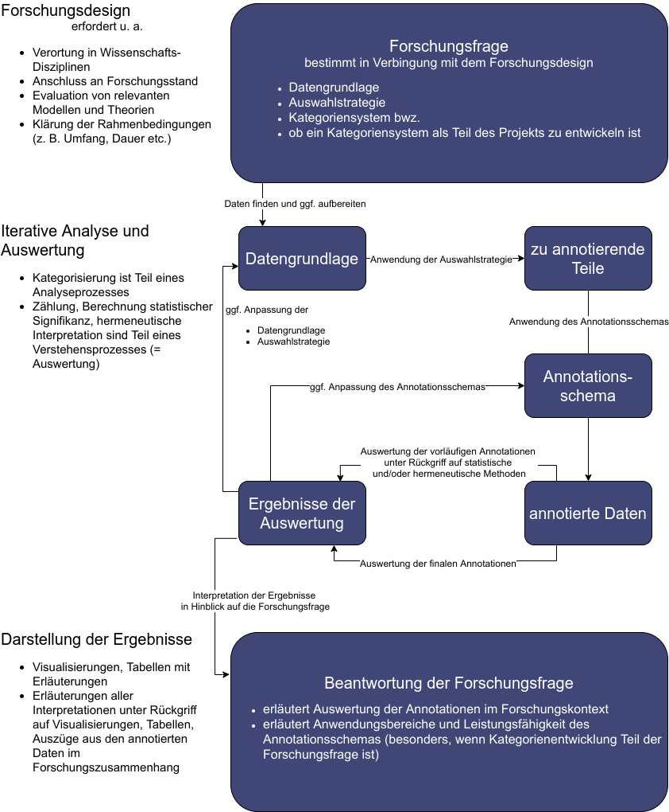
[Einbettung von Annotationsarbeiten in ein Forschungsprojekt]

# 3 Annotation in den Geisteswissenschaften

Annotation is one of the most important scholarly primitives in the humanities […]. Annotation tools can demonstrate,
perhaps like no other tool can, the usefulness of bringing the digital into the
humanities. [(Meister 2015 15:20 min)](https://www.zotero.org/google-docs/?TmTf90)

## 3.1 Annotation: Anreicherung mit Zusatzinformation

"[Annotation is] the act of creating associations between distinct pieces of information […]" (W3C 2014) oder, etwas
weniger allgemein, "the activity of making information about a digital object explicit by adding, e.g., comments,
metadata or keywords to a digitized representation or to an annotation file associated with it". (dhtaxonomy/TaDiRAH
2014). Annotation ist also die Anreicherung von Information mit Zusatzinformation und als solches eine zentrale
geisteswissenschaftliche Methode, die sehr gut auf digital vorliegende Objekte angewandt werden
kann [(vgl. Schmunk u. a. 2014)](https://www.zotero.org/google-docs/?kwC1pQ). Sowohl Metadaten, also z. B. die Angabe
des Autors eines Buches, als auch sehr kleinteilige Zusatzinformationen wie die Wortart eines einzelnen Wortes sind
Annotationen in diesem Sinne. Annotationen können automatisch oder manuell durchgeführt werden. Automatische
Annotationswerkzeuge sind z. B. Lemmatisierer, die jedem Wort in einem Text die entsprechende Grundform zuordnen.
Programme zur manuellen Annotation erlauben es, digital vorliegende Texte, Bilder, Audio- und Videoaufnahmen von Hand
mit vorhandenen Klassifizierungssystemen auszuzeichnen oder anhand der Annotationen ein eigenes Klassifizierungssystem
zu erstellen. Um eine Forschungsfrage bearbeiten zu können, müssen nicht zwangsläufig alle Primärdaten – ein ganzes
Textkorpus, ein vollständiges Bild, eine komplette Gesprächsaufnahme etc. – annotiert werden. Vor allem bei manueller
Annotation bietet es sich an, gezielt die Teile zu annotieren, die für die Forschungsfrage relevant sind. Die
Strategien, wie relevante Teile der Primärdaten identifiziert werden können, hängen dabei vom Medium ab. Aus Sicht der
Geisteswissenschaften ist Annotation nichts Neues. Im Gegenteil, Notizen und Anmerkungen zu einem Text festzuhalten ist
ein grundlegendes traditionelles (geistes-)wissenschaftliches Vorgehen, eines der "scholarly
primitives" [(Unsworth 2000: 1)](https://www.zotero.org/google-docs/?X9nX2S). Dabei spielt es keine Rolle, ob sie direkt
an den Rand in ein Buch geschrieben oder in einem extra dafür angelegten Notizbuch oder Zettelkasten gesammelt werden.
Auch Unterstreichungen oder sonstige Hervorhebungen zählen zu diesen gebräuchlichen und analogen Formen der
Annotation [(vgl. Brockman & Digital Library Federation 2001: 7)](https://www.zotero.org/google-docs/?YPSU5Q).
Zusatzinformationen können sich auf ein Digitalisat im Ganzen oder auf Teile davon beziehen. Eher objektive
Zusatzinformationen wie Autor und Erscheinungsjahr bei Büchern, Künstler und Erschaffungsjahr bei Kunstwerken oder
Fundstelle und vermutliches Alter bei archäologischen Funden werden dabei als "Metadaten" bezeichnet:
"Metadata is structured information that describes, explains, locates, or otherwise makes it easier to retrieve, use, or
manage an information resource. Metadata is often called data about data or information about
information." [(National Information Standards Organization (U.S.) 2004: 1)](https://www.zotero.org/google-docs/?iMPGCa)
Eher interpretatorische Informationen wie Wortart, Aussage, kultureller Stellenwert o. Ä. werden hingegen als
Annotationen bezeichnet. Annotation: Auszeichnung linguistischer Informationen i. d.R. mithilfe einer Mark-up-Sprache.
Hierbei werden dem Primärtext interpretative Analysen auf unterschiedlichen linguistischen Ebenen (Phonetik, Syntax,
Semantik, Pragmatik, Diskurs, Stil, Lexik) hinzugefügt. Besondere Annotationen sind Fehlerannotationen in Lernerkorpora
sowie die Transkription gesprochener Sprache in
Sprachkorpora. [(Eintrag „Annotation“: Glück & Rödel 2016)](https://www.zotero.org/google-docs/?uJLSel)
Dabei ist zu beachten, dass manche Definitionen, wie z. B. die oben angeführte von TaDiRAH, auch Metadaten als (eine
Form der) Annotation betrachten.

## 3.2 Annotation: Anwendung vs. Erstellung eines Kategoriensystems

Annotation kann als Methode aus zwei Richtungen betrachtet werden: Zum einen unterstützen Annotationen den Prozess der
Kategorienbildung im Sinne der Erstellung eines Kategoriensystems, zum anderen erlaubt das Annotieren, vorhandene
Kategorien in den annotierten Daten explizit zu machen. Vorhandene Kategorien können sich auf alle Dimensionen von Text
beziehen, zum Beispiel:

| Beispiel 	| Dimension der Zusatzinformation 	| Bezugsgröße 	| Beispiel für Kategoriensystem 	|
|---	|---	|---	|---	|
| Autor eines Werks Veröffentlichungsdatum eines Werks 	| bibliographisch 	| konkretes physisches oder nativ digitales Objekt 	| [Dublin Core](https://www.dublincore.org/):  * _[creator](https://www.dublincore.org/specifications/dublin-core/dcmi-terms/terms/creator/)_ * _[date](https://www.dublincore.org/specifications/dublin-core/dcmi-terms/terms/date/)_  [TEI](https://tei-c.org/) P5  * _[author](https://www.tei-c.org/release/doc/tei-p5-doc/en/html/ref-author.html)_ * _[date](https://www.tei-c.org/release/doc/tei-p5-doc/en/html/ref-date.html)_ 	|
| Kapitel Zeilenumbruch 	| formale Struktur 	| Text 	| TEI:  * [div-Element mit Attribut type= "chapter"](https://www.tei-c.org/release/doc/tei-p5-doc/en/html/ref-div.html) * [lb-Element](https://www.tei-c.org/release/doc/tei-p5-doc/de/html/ref-lb.html) 	|
| Pergament zerrissene Seite 	| materiale Beschaffenheit 	| konkretes physisches Objekt 	| TEI:  * [material-Element](https://www.tei-c.org/release/doc/tei-p5-doc/de/html/ref-objectDesc.html) * [condition-Element](https://www.tei-c.org/release/doc/tei-p5-doc/de/html/ref-condition.html) 	|
| verzierte Initiale Schriftfarbe 	| ästhetische Beschaffenheit 	| konkretes physisches oder nativ digitales Objekt 	| TEI:  * [decoNote-Element](https://www.tei-c.org/release/doc/tei-p5-doc/de/html/ref-decoNote.html) * [rendition-Element](https://www.tei-c.org/release/doc/tei-p5-doc/de/html/ref-rendition.html)  	|
| Exposition, Konflikt, Klimax 	| Erzählstruktur 	| Text 	| TEI:  * [spanGrp-, span-Element mit Verweis auf xml:id](https://www.tei-c.org/release/doc/tei-p5-doc/de/html/AI.html#AISP) 	|
| Protagonist 	| Figurenanalyse 	| Text 	| TEI:  * [spanGrp-, span-Element mit Verweis auf xml:id](https://www.tei-c.org/release/doc/tei-p5-doc/de/html/AI.html#AISP) 	|

[mögliche Annotationskategorien; unvollständige Beispielliste]

### 3.2.1 Kategorienbildung durch Annotation

Die Kategorienbildung dient entweder der Erstellung eines Gold-Standards für automatische Annotation oder der Erstellung
einer Taxonomie oder Ontologie. In beiden Fällen ist sie ein vollwertiges Forschungsergebnis. Die Erstellung eines
Kategoriensystems auf der Grundlage von Annotationen ist immer ein iterativer Prozess. Zweifelsfälle in der
Kategorisierung können zu einer Verfeinerung des Kategoriensystems führen, was eine Prüfung und gegebenenfalls Korrektur
der bereits vorgenommenen Annotationen erfordert.

#### 3.2.1.1 Beispiel: "Heuristische Textpraktiken in den Wissenschaften" [(Bender & Müller 2020)](https://www.zotero.org/google-docs/?GxkFdQ)

In ihrer Studie analysieren Bender und Müller
"Formulierungsverfahren, mit denen in institutionell verankerten Routinen neues Wissen generiert und an vorhandenes
Wissen angeschlossen wird, z. B. ‚die Relevanz eines Forschungsthemas markieren‘, ‚einen Begriff definieren‘ oder ‚eine
Aussage argumentativ stützen‘. Ziel ist es herauszufinden, in welchem Ausmaß, in welcher Verteilung und mit welcher
Kombinatorik solche Textpraktiken in unterschiedlichen wissenschaftlichen Disziplinen vorkommen und welche Effekte
fachkulturelle Kontexte auf heuristische Textpraktiken
haben." [(Bender & Müller 2020: 2)](https://www.zotero.org/google-docs/?LmeoFo)
Um eine solche Studie durchzuführen, bedarf es eines Klassifizierungsschemas, das es ermöglicht, verschiedene Typen
heuristischer Textpraktiken zu identifizieren. Da ein solches Schema nicht vorliegt, ist die Entwicklung des Schemas ein
unverzichtbarer Teil des Forschungsprojekts und gleichzeitig ein Forschungsergebnis: "Da das Annotationsschema nach
unserem Modell der forschenden Annotation bereits ein wichtiges Ergebnis darstellt, präsentieren wir dieses entsprechend
im Ergebniskapitel (Kap. 6)." [(Bender & Müller 2020: 3)](https://www.zotero.org/google-docs/?5FcGuk) Die Ausgangsbasis
bildete ein taxonomisches Annotationsschema (bestehend aus den Basiskategorien *Exposition*, *Definition* und *Stützung*
von Assertionen), "das aus Kategorien besteht, die aus den theoretischen Vorüberlegungen hergeleitet wurden. Diese
Kategorien grenzen verschiedene in Fachdiskursen konventionalisierte Praktiken der heuristischen
Komplexitätsreduktion [...] voneinander ab, also Selektions- und Entscheidungsroutinen [...], die durch bestimmte
Ausdrücke indiziert werden." [(Bender & Müller 2020: 18)](https://www.zotero.org/google-docs/?Y6No2q)
Das Annotieren von Texten mit solchen Basiskategorien führt zu einer ständigen Überprüfung der Kategorien und ihrer
Definitionen. Wird im Verlaufe der Arbeit deutlich, dass die Kategorien nicht ausreichen oder nicht die richtige
Analyse-Granularität zulassen, wird das Klassifzierungsschema erweitert. Jede Erweiterung erfordert es, die schon
durchgeführten Annotationen zu überprüfen und an das veränderte Schema anzupassen (s. Annotationsschleife in Abbildung "
Einbettung von Annotationsarbeiten"). Das Ergebnis dieser Annotationsschleife ist ein in Bezug auf die Forschungsfrage
ausgereiftes Kategoriensystem. Die Verfeinerungen der Basiskategorien im Forschungsprojekt von Bender und Müller zeigt
die folgende Grafik:

[Kategoriensystem "HeuTex" [(Bender & Müller 2020: 23)](https://www.zotero.org/google-docs/?R2Tf7f)]

### 3.2.2 Kategorisierung durch Annotation

Kategorisierungen sind Anwendungen von Kategoriensystemen auf Daten, sie liegen immer dann vor, wenn das Vorkommen
bestimmter Kategorien explizit gemacht wird, wie es z. B. bei der Auszeichnung aller Wörter eines Textes mit
Wortartangaben der Fall ist. Dies kann sich auf Text-, Bild-, Audio- oder Videodaten beziehen. Im Falle von Audio- oder
Video-Daten können die Annotationen auch als Textannotation an die Transkription gebunden werden. Kategorienbildung und
Kategorisierung kommen auch in Kombination vor. Dabei sind sowohl die Kategorienbildung als auch die Anwendung und
Auswertung der dadurch definierten Kategorien Forschungsergebnisse.

#### 3.2.2.1 Beispiel: "'The question is, how cruel is it?' Keywords, Foxhunting and the House of Commons" [(Baker 2006)](https://www.zotero.org/google-docs/?eEL2NI)

Die Grundlage für Bakers Untersuchung sind die Debatten zur Fuchsjagd, die 2002-2003 im britischen Parlament gehalten
wurden. Sein Forschungsinteresse richtet sich auf statistisch signifikante Wörter (*keywords*) und Kategorien (*key
categories*), die von den Befürwortern und Gegnern verwendet wurden. Während Keywords ohne Annotation aus
Frequenzvergleichen der Teilkorpora errechnet werden
können [(Demmen & Culpeper 2015)](https://www.zotero.org/google-docs/?E8CYSK), können Key-Kategorien erst dann berechnet
werden, wenn die vorliegenden Texte mit entsprechenden Kategorien annotiert wurden. Baker nutzt hierzu USAS (UCREL
Semantic Analysis System), ein System zur automatischen Annotation von Texten mit semantischen Kategorien. Nach der
Berechnung der Key-Kategorien analysiert er die Konkordanzen aller mit diesen Kategorien ausgezeichneten
Wörter  [(Baker 2006: 6 f)](https://www.zotero.org/google-docs/?Swcp2d):

Two key tags which occurred significantly more often in the pro-hunt speeches were S1.2.6 ‘sensible’ and G2.2 ‘ethics –
general’. Looking at a concordance of words that were tagged as S1.2.6 (Table 5 shows a small sample from of the total
number of cases) it is clear that this contains a list of words relating to issues of sense: sensible, reasonable,
common sense, rational, ridiculous, illogical and absurd. The prevalence of this class of words is due to the way that
the pro-hunt speakers construct the proposed ban on hunting (as ridiculous, illogical and absurd) and the alternative
decision to keep hunting (as reasonable, sensible and rational). While this way of presenting a position would appear to
make sense in any argument it should be noted that the anti-hunt speakers did not tend to characterise the debate in
this way. They did not argue, for example, that their position was sensible, reasonable etc. and that of their opponents
was ridiculous and absurd. It is also worth noting that one feature of hegemonic discourses is that they are seen as
‘common-sense’ ways of thinking. To continually refer to your arguments in terms of ‘common-sense’ is therefore a
powerful rhetorical strategy. With this sort of analysis, we are not only seeing the presence of discourses in texts,
but we are also uncovering evidence of how they are repeatedly presented as the ‘right’ way of viewing the world.

# 4 Annotationsarten und -werkzeuge

## 4.1 Editionsphilologische Annotation für Text, Bild, Noten: Metadaten, Struktur, Klassifizierung

### 4.1.1 Forschungsinteressen

Grundlegende Themen der Editionsphilologie (Editionswissenschaften) umfassen z. B.

* Textkonstitution: Erstellung einer Ausgabe eines Werks auf der Grundlage einer oder mehrerer bestimmter Textfassungen
* Textgenese: Dokumentation der Entstehung, z. B. durch Gegenüberstellung verschiedener Entwicklungsstufen eines Textes
* Textrekonstruktion: Wiederherstellung eines "nur entstellt überlieferten Originals [...] am Kreuzungspunkt von
  Entstehungs- und Überlieferungsgeschichte" [(Bohnenkamp-Renken 2002)](https://www.zotero.org/google-docs/?zJ0Cde)
* Materialität: Dokumentation der materialen Beschaffenheit (verschiedener Fassungen) eines Werks Ein zentrales Anliegen
  der Editionswissenschaft ist "einen gesicherten Text
  herzustellen" [(Seiffert 2005: 162)](https://www.zotero.org/google-docs/?jbJbJQ), woraus sich die
  editionswissenschaftlichen und editionstheoretischen Forschungsinteressen, Methoden und Modelle ableiten. Das
  übergeordnete Forschungsinteresse verfolgt dabei immer das Ziel, die Bedingungen zu erforschen und zu schaffen, die es
  erlauben, schriftlich tradierte Kulturerzeugnisse auf angemessene Weise zugänglich zu machen. Die Sicherung eines
  Textes greift dabei vor allem auf textkritische Methoden zurück, also auf die systematische Erfassung und Auswertung
  allen verfügbaren Materials, das zur Herstellung eines gesicherten Textes beiträgt. Diese Vorgehensweise erfordert
  auch eine Auseinandersetzung mit dem zugrundeliegenden Textbegriff bzw. -modell, speziell hinsichtlich der Frage, ob
  ein gesicherter Text im editionsphilologischen Sinne ein finales Produkt oder die Darstellung eines (Ausschnittes
  eines) Entstehungsprozesses ist [(vgl. Nutt-Kofoth 2012: 21)](https://www.zotero.org/google-docs/?Cwk9Cr). Es macht
  einen großen Unterschied, ob ältere Literatur oder neuere Literatur ediert werden soll. Ältere Literatur liegt
  normalerweise nur in voneinander abweichenden und teilweise unvollständig erhaltenen Abschriften bzw. Lesarten vor.
  Einen vom ursprünglichen Autor autorisierten Text gibt es nicht. Hier ist ein Ziel des editionswissenschaftlichen
  Arbeitens, "diesen aus den oftmals über Jahrhunderte hinweg überlieferten, häufig fehlerhaften oder willkürlich
  veränderten Abschriften zu rekonstruieren" [(Plachta 2013: 27)](https://www.zotero.org/google-docs/?mItaRL).
  Editionsprojekte neuerer Texte können hingegen eher auf vom Autor autorisierte Fassungen zurückgreifen, weshalb die
  Rekonstruktion eines "originalen" Textes nicht im Zentrum steht. Stattdessen rückt die Entstehungsgeschichte des
  autorisierten Textes in den Mittelpunkt des Interesses. In jedem Fall müssen die dem "gesicherten" Text
  zugrundeliegenden Überlegungen und Materialien dokumentiert und - je nach Editionsziel - dem Nutzer einer Edition
  zugänglich gemacht werden. Editionen bestehen daher aus mehreren Teilen, dem edierten Text und Erläuterungen zur
  Überlieferungslage bzw. zur Textgenese (= *kritischer Apparat*, *genetischer Apparat*). Die Erläuterungen zum edierten
  Text können auch weitere Themen umfassen wie z. B. die Rezeptionsgeschichte des Textes, sozio-historische Einordnungen
  oder biografische Angaben zum Autor.

#### 4.1.1.1 Edition neuerer Texte

Bei der Edition neuerer Texte muss recht früh festgelegt werden, ob die *Ausgabe letzter Hand* oder die *Ausgabe erster
Hand* als Grundlage für den herzustellenden gesicherten Text herangezogen werden soll. Die Ausgabe letzter Hand ist
dabei die letzte vom Autor autorisierte Fassung, die Ausgabe erster Hand die erste vom Autor zum Druck freigegebene
Fassung. Die Ansichten, welcher Fassung mehr Authentizität zuzuschreiben ist, sind unterschiedlich. Die Herausgeber der
Weimarer Goethe-Ausgabe wählten die Ausgabe letzter Hand als Grundlage, weil sie dem Willen Goethes am ehesten
entspräche und ihr somit die größte Autorität zukomme: "Für den Druck der Werke hat er selbst die Norm gegeben in der
Ausgabe letzter Hand." [(Suphan 2005: 51)](https://www.zotero.org/google-docs/?sK1SWk)
Neben der Grundlage für die Edition muss auch entschieden werden, welcher Adressatenkreis von der Edition erreicht
werden soll. Generell unterscheidet die Editionswissenschaft drei Editionstypen: Die *historisch-kritische Ausgabe* hat
den höchsten Komplexitätsgrad und Vollständigkeitsanspruch. Die *Studienausgabe* rückt den edierten Text etwas mehr in
den Mittelpunkt, präsentiert aber immer noch eine auch wissenschaftlich nutzbare Menge an genetischen und weiteren
Zusatzinformationen. Die *Leseausgabe* ist die am wenigsten angereicherte Ausgabe. Der Text selbst ist üblicherweise an
die orthografischen Konventionen der jeweiligen Publikationszeit der Edition angepasst; Hinweise auf die Textgenese und
weitere Zusatzinformationen sind eher als Fließtext in Anhängen zu finden (wenn überhaupt). Ähnlich wie bei älterer
Literatur liegt auch neuere Literatur in mehreren Fassungen vor, die für eine vollständige historisch-kritische Ausgabe
alle ausgewertet werden müssen. Eindrucksvoll demonstriert dies z. B. die online zugängliche Faustedition:

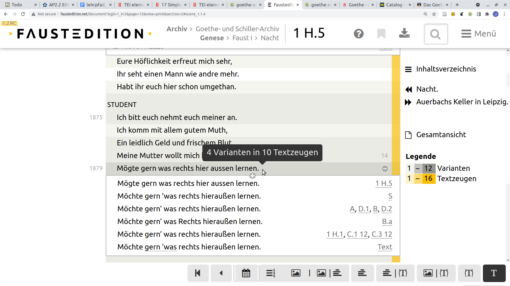
[Faust-Edition als Beispiel für historisch-kritische Editionsarbeit]()
Für jede Zeile der Edition werden per Annotation die Varianten in den Textzeugen hinterlegt und über Transformationen
auf der Web-Oberfläche zugänglich gemacht.

#### 4.1.1.2 Edition älterer Texte

Bei der Edition älterer Texte stehen handschriftliche Abschriften im Mittelpunkt. Diese können über einen Jahrhunderte
überspannenden Zeitraum erstellt worden sein und je nach Überlieferungslage auch nur in Fragmenten vorliegen. So sind
der Forschung z. B. 16 Handschriften und 72 Fragmente von Wolframs von Eschenbachs zwischen 1200 und 1210 entstandenem *
Parzival*-Roman bekannt (Stand 2020), die zwischen dem 13. und 15. Jahrhundert
entstanden [(vgl. Stolz 2014, 2021 (speziell den Punkt „Handschriftenverzeichnis“))](https://www.zotero.org/google-docs/?aSiX1g)
. Da die Abschriften eines Werkes unterschiedlichen Grundlagen folgen (können), ist eine editionswissenschaftliche
Aufgabe die Identifizierung von unterschiedlichen Textfassungen, denen die einzelnen Textzeugen zugeordnet werden
können. Das Parzival-Projekt[(Stolz 2021)](https://www.zotero.org/google-docs/?bXjKsM) geht von vier Textfassungen aus,
die mit Bezug zu den ihnen am nächsten stehenden Handschriften als *D, *m, *G und *T bezeichnet werden. Dabei zeigt der
Asterisk (*) an, dass es sich um eine konstituierte Textfassung handelt und der Buchstabe verweist auf die Handschrift (
vgl. auch das [Handschriftenverzeichnis](https://www.parzival.unibe.ch/hsverz.html) des Parzival-Projekts).

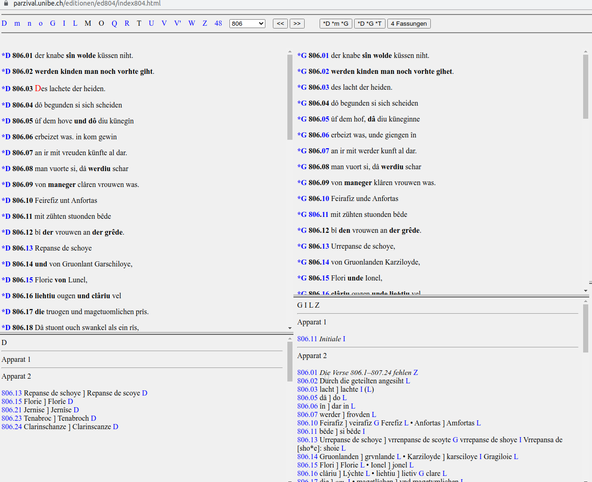
[Parzival-Projekt, Universität Bern: Fassungen im Vergleich. [(vgl. Stolz 2021)](https://www.zotero.org/google-docs/?Z1BVAD) Auf der [Originalseite](https://www.parzival.unibe.ch/editionen.html) werden 4 Fassungen nebeneinander dargestellt. Der besseren Lesbarkeit halber werden hier nur zwei wiedergegeben.]

Abweichungen von der konstituierten Textfassung werden in Apparat 2 im unteren Teil der Seite verzeichnet. Die Siglen
sind mit Links hinterlegt, die direkt auf eine parallele Darstellung von Digitalisat und Transkription führen.

[Parzival-Projekt, Universität Bern: Parallele Darstellung von Transkription und Digitalisat eines Textzeugen (Ausschnitt)]

Die Verlinkung erlaubt, die in der *-Textfassung angezeigte Abweichung im Kontext zu betrachten. Im vorliegenden
Beispiel heißt dies also, dass die unter der Textfassung *G in Apparat 2 angezeigte Abweichungen im Textzeuge L
nachvollzogen werden können: Besonders auffällig ist Vers 806.2, der in L vollkommen anders lautet als in *G.

#### 4.1.1.3 Edition musikalischer Werke

Die Erstellung einer musikwissenschaftlichen Edition ist der Erstellung von Text-Editionen hinsichtlich der zu
bewältigenden Aufgaben vergleichbar. Ähnlich wie bei der Edition neuerer und älterer Texte gilt es, bestehende Fassungen
zu sichten und je nach Zielstellung die Unterschiede zwischen diesen Fassungen nachvollziehbar zu machen, in anderen
Worten also "durch die Dokumentation der Entstehungs- und Überlieferungsgeschichte des Werks in Verbindung mit einer
kritischen Sichtung aller erreichbaren
Überlieferungsträger" [(Allroggen 2011 (§3 der Editionsrichtlinien für Notenbände))](https://www.zotero.org/google-docs/?Umcfaz)
eine historisch-kritische Ausgabe anstreben. Das Projekt "Carl-Maria-von-Weber-Gesamtausgabe" strebt an, sämtliche "
Kompositionen, Briefe, Tagebücher und Schriften in einer wissenschaftlich-kritischen Gesamtausgabe
vorzulegen" [(Allroggen 2011 (Projektbeschreibung))](https://www.zotero.org/google-docs/?rv8MRc) , verbindet also die
Text- und Notenedition.

[Carl-Maria-von-Weber-Gesamtausgabe: Projektübersicht]

### 4.1.2 Werkzeuge

#### 4.1.2.1 TextGrid-Lab [(Neuroth 2015)](https://www.zotero.org/google-docs/?pRhMZZ)

Das TextGrid-Lab ist eine Komponente der virtuellen Forschungsumgebung [TextGrid](https://textgrid.de/), die für die
Arbeit mit Text- und XML-Dateien optimiert ist. Obwohl der prototypische Nutzer eher editionsphilologische
Forschungsinteressen hat, erlaubt das Arbeiten in XML-Dateien jede Form der Annotation auf allen Textebenen und auch die
Anwendung selbst definierter Klassifizierungen. Dies setzt jedoch voraus, dass der Umgang mit XML entweder erlernt
werden muss oder bereits vertraut ist.
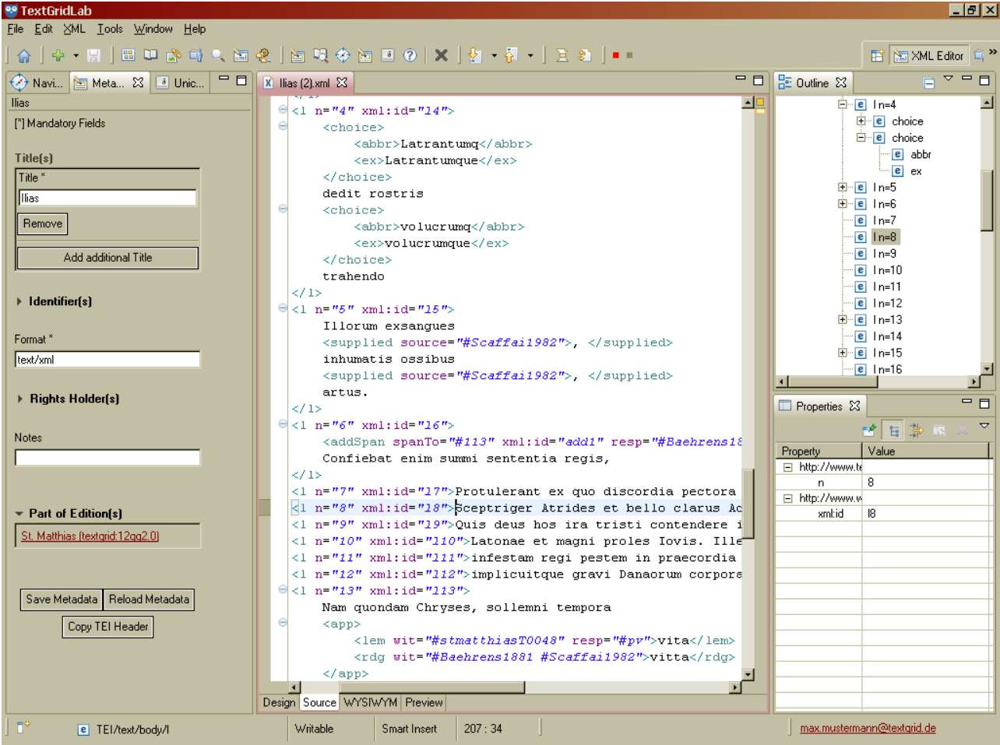
[Eingebauter XML-Editor in TextGrid-Lab. Der lizenzpflichtige Editor Oxygen kann nachinstalliert werden.]

[Bild-Annotations-Editor in TextGrid-Lab]

#### 4.1.2.2 MEI Score Editor: Noten-Editor

Der MEI Score Editor steht [als Online-Service](https://meise.de.dariah.eu/),
als [Teil des TextGrid-Services](https://textgrid.de/web/guest/textgrid-tools-und-services) und
als [Desktop-Application](https://sourceforge.net/projects/meise/files/) zur Verfügung. Er dient der Bearbeitung von
Musik-Noten nach dem [MEI-Standard](https://music-encoding.org/) als XML und ermöglicht es u. a., Editionen von Werken
mit kritischen Apparaten (z. B. Variantenerfassung) und Annotationen zur Werkanalyse zu erstellen (s. hierzu
die [MEI-Guidelines](https://music-encoding.org/guidelines/v4/content/)).

[MEI Score Editor als Online-Service.]

## 4.2 Audio- und Video-Annotation

### 4.2.1 Forschungsinteressen

Die Gesprächsforschung hat ihre Wurzeln "in der Soziologie (z. B. Konversationsanalyse, Ethnomethodologie und
Goffmansche Interaktionsanalyse), der Linguistik (z. B. Gesprochene-Sprache-Forschung und Soziolinguistik), der
Ethnologie (Ethnographie der Kommunikation), der Philosophie (z. B. Gebrauchstheorie der Bedeutung, Gricesche Pragmatik,
Sprechakttheorie und Foucaultsche Diskursanalyse) und der Psychologie (Organon-Modell, Tätigkeitstheorie, Untersuchung
der nonverbalen Kommunikation und von
Interaktionssystemen)" [(Deppermann u. a. 2000: 1)](https://www.zotero.org/google-docs/?PtBntk). Auch wenn sich daraus
entstandenen Ansätze, z. B. *ethnomethodologische
Konversationsanalyse *[(vgl. z. B. Sidnell 2013)](https://www.zotero.org/google-docs/?KoWltE), *linguistische
Gesprächsanalyse *[(vgl. z. B. Brinker u. a. 2000; Deppermann 2008)](https://www.zotero.org/google-docs/?jQUM51) und *(
funktional-pragmatische) Diskursanalyse*, zum Teil stark voneinander
unterscheiden [(vgl. z. B. Galinski 2004)](https://www.zotero.org/google-docs/?LqSMX1), so ist ihnen allen ein
empirischer Umgang mit gesprochener Sprache gemeinsam. Die Erstellung eigener Gesprächskorpora ist sehr aufwendig: Nicht
nur müssen die Teilnehmer zustimmen, dass Gespräche aufgezeichnet, (in Teilen) veröffentlicht und wissenschaftlich
ausgewertet werden. Die dazu notwendige technische Ausrüstung muss ebenfalls zur Verfügung stehen und bedient werden
können. Allerdings lohnt sich je nach Zielsetzung der Aufwand natürlich, da auf diese Weise genau die Daten erhoben
werden können, die für die Bearbeitung einer Fragestellung notwendig sind. Ein technisches Grundproblem für alle
genannten Ansätze ist die Aufzeichnung und Weiterverarbeitung gesprochener Sprache auf eine Weise, die die
wissenschaftliche Auswertung erlaubt. Generell werden die Aufzeichnungen transkribiert, also verschriftlicht, und über
Zeit-Codes mit der Aufnahme aligniert. Dabei unterscheiden sich die Transkriptionsarten je nach Zielsetzung und
Fragestellung. So kann eine Verschriftlichung ohne Hinweise auf paraverbale oder non-verbale Phänomene für
Fragestellungen ausreichend sein, die sich eher auf die Lexik stützen. Sollen jedoch die speziellen Phänomene
gesprochener Sprache ebenfalls berücksichtigt werden, müssen diese auch in der Transkription erfasst werden. Dies
betrifft z. B. prosodische Elemente wie "der Tonhöhenverlauf gesprochener Sprache in der Zeit, Lautstärke, Länge, Pause,
sowie die damit zusammenhängenden komplexeren Phänomene Sprechgeschwindig- keit/Tempo und
Rhythmus" [(Selting 1995: 1)](https://www.zotero.org/google-docs/?MmrEbq). Das im Bereich der linguistischen
Gesprächsanalyse entwickelte Transkriptionsystem GAT2 (Gesprächsanalytisches Transkriptionssystem) unterscheidet daher
zwischen Minimal-, Basis- und Feintranskript [(vgl. Selting & Auer 2009)](https://www.zotero.org/google-docs/?XVuqNR).
Das im Bereich der funktional-pragmatischen Diskursanalyse entwickelte Transkriptionssystem HIAT (Halbinterpretative
Arbeitstranskriptionen) folgt ähnlichen
Prinzipien [(vgl. Rehbein u. a. 2004)](https://www.zotero.org/google-docs/?SFrNWM).

### 4.2.2 Ressourcen und Werkzeuge

#### 4.2.2.1 [Datenbank für gesprochenes Deutsch (DGD)](https://dgd.ids-mannheim.de/dgd/pragdb.dgd_extern.welcome?v_session_id=) [(IDS Mannheim 2014)](https://www.zotero.org/google-docs/?KCzmaZ)

Die Datenbank für gesprochenes Deutsch (DGD) des Instituts für deutsche Sprache, Mannheim bietet Zugriff auf 39
Audio-Korpora, die mit Metadaten, Annotationen und Transkriptionen erschlossen wurden. Die Transkriptionen können direkt
auf der Webseite mitsamt Metadaten und Annotationen durchsucht und analysiert werden.

[Suchanfrage nach Lemma "Apfel" im *Forschungs- und Lehrkorpus Gesprochenes
Deutsch* (FOLK) der DGD [(entnommen: Schmidt & Kaiser 2016: 3)](https://www.zotero.org/google-docs/?7utcRI)]

#### 4.2.2.2 [TalkBank](https://talkbank.org/) [(MacWhinney & Wagner 2010)](https://www.zotero.org/google-docs/?0he85p)

Die TalkBank ist eine Sammlung von Ressourcen und Software, darunter z. B. CHILDES (*Child Language Data Exchange
System*), ein Korpus, das Sprachaufnahmen und Transkripte von Kindern in mehreren Sprachen verfügbar macht, und die
Software CLAN (*Computerized Language ANalysis*), die speziell dafür entwickelt wurde, Daten zu analysieren, die im
CHAT-Format (*Codes for the Human Analysis of Transcripts*) transkribiert
wurden [(MacWhinney 2000)](https://www.zotero.org/google-docs/?ggoq8w). CLAN bietet Konversionsmöglichkeiten aus CHAT zu
einer Reihe von Annotations- und Analysesoftware, darunter auch EXMARaLDA und elan (s. u.).

[Ausschnitt eines deutschsprachigen Transkripts des [CHILDES-Korpus](https://sla.talkbank.org/TBB/childes)]

#### 4.2.2.3 [EXMARaLDA](https://exmaralda.org/de/): Audio- und Videoannotation [(Schmidt 2004)](https://www.zotero.org/google-docs/?a9W4Km)

EXMARaLDA erlaubt das zeitalignierte Annotieren von Audio- und Videodateien in einem sogenannten "Partitur-Editor".
EXMARaLDA ist eine Einzelplatz-Software und wird kostenlos zum Download für Windows, Mac und Linux angeboten.
Das [Demo-Korpus](https://corpora.uni-hamburg.de/hzsk/de/islandora/object/spoken-corpus%3Ademo-1.0) bietet einen guten
Startpunkt, um den Umgang mit dem System zu lernen.

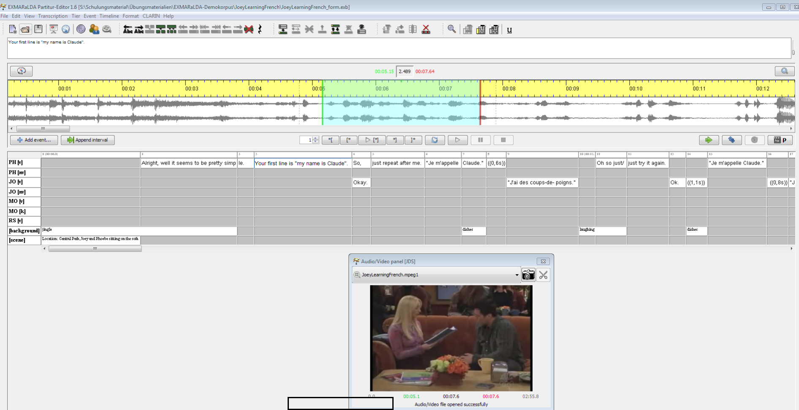
[Partitur-Editor in EXMARaLDA]

#### 4.2.2.4 [elan (Eudico Linguistik Annotator)](https://archive.mpi.nl/tla/elan/download): Videoannotation [(Wittenburg u. a. 2006)](https://www.zotero.org/google-docs/?bn1Wry)

Elan ist für Audio- und Videotranskription geeignet und wurde vom Max-Planck-Institut für Psycholinguistik in Nijmegen
entwickelt.

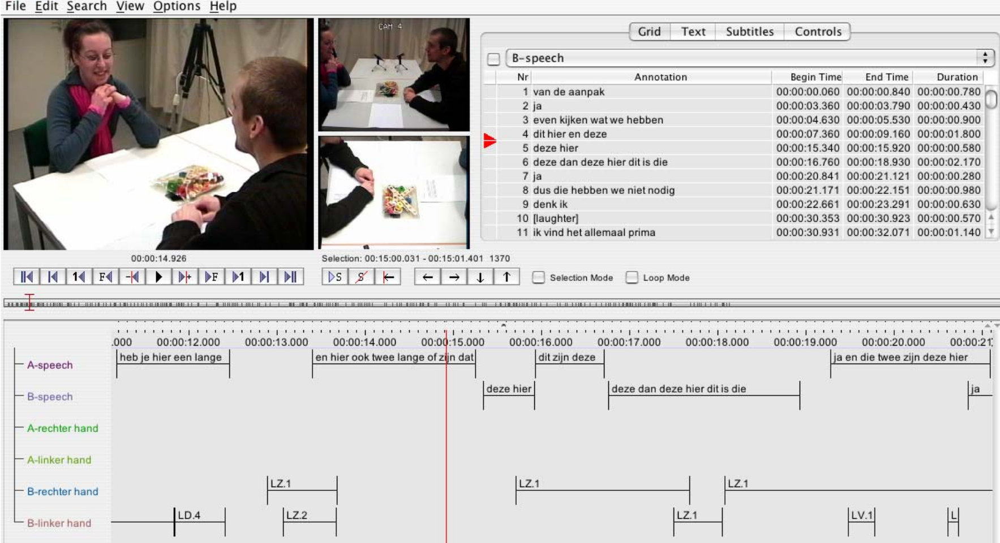
[Annotationsansicht in elan [(Wittenburg u. a. 2006: 1558)](https://www.zotero.org/google-docs/?5zHiaw)

## 4.3 Automatische Text-Annotation auf Satz- und Wortebene

### 4.3.1 Forschungsinteressen

Die automatische Text-Annotation dient vor allem dazu, große Textmengen mit bestimmten (sprachwissenschaftlichen)
Zusatzinformationen auf der Satz- und Wortebene auszuzeichnen. Dies betrifft z. B. Satzglieder, Relationen zwischen
Satzgliedern, Wortarten, Grundformen von Wörtern (Lemmata) und morphologische Informationen wie Kasus, Genus, Tempus.

### 4.3.2 Werkzeuge

#### 4.3.2.1 Language Resource Switchboard: Suchmaschine für Textwerkzeuge

Werkzeuge für die automatische Weiterverarbeitung von Texten finden Sie am einfachsten über
das [LRS (Language Resource Switchboard)](https://switchboard.clarin.eu/).

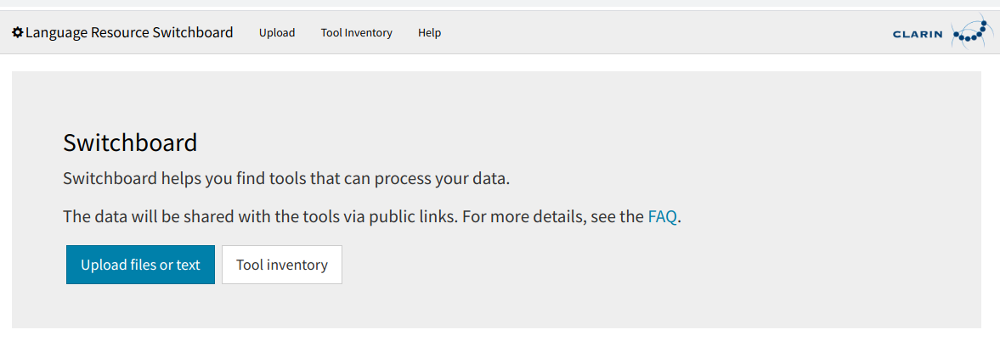
[Startseite des Language Resource Switchboards]

Klicken Sie hierzu einfach auf "Upload files or text" und laden Sie als Nächstes eine Datei von Ihrem Computer auf den
Server. Falls die Datei nicht auf Ihrem Computer gespeichert, aber über das Internet direkt erreichbar ist, können Sie
auch die entsprechende Webadresse angeben. Als dritte Möglichkeit können Sie auch Text direkt eingeben.

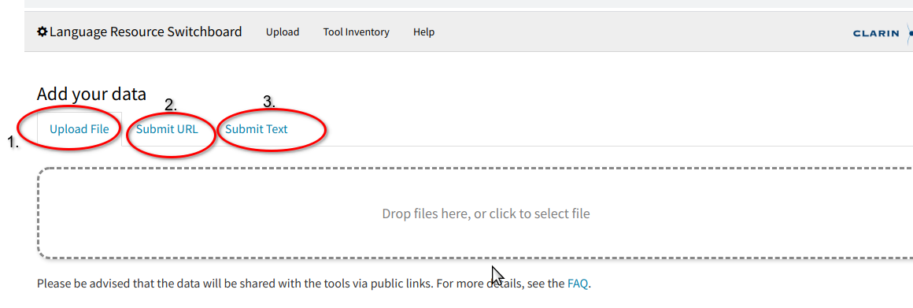
[Upload-Möglichkeiten des LRS]

Das LRS prüft das Dateiformat und die Sprache und zeigt alle Werkzeuge an, die für die Weiterverarbeitung des erkannten
Formats und der erkannten Sprache zur Verfügung stehen. Sollten Format oder Sprache falsch erkannt werden, können Sie
die Auswahl von Hand korrigieren.

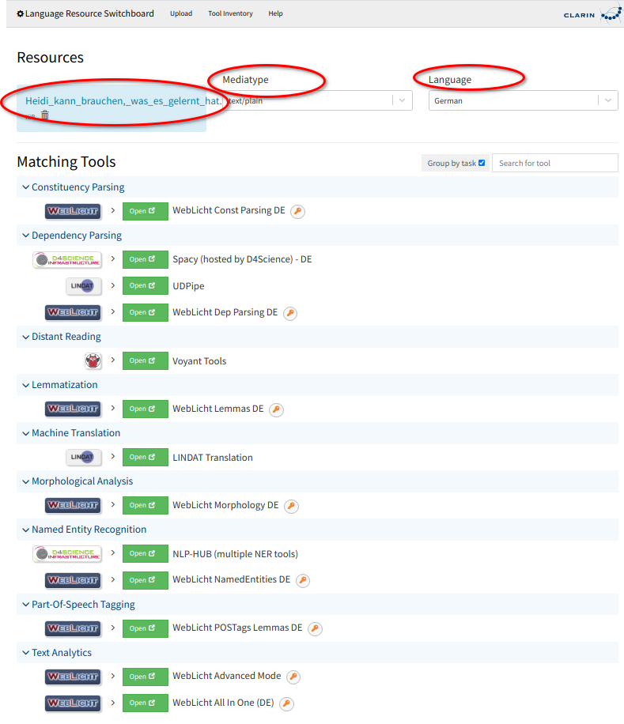
[Ergebnisanzeige des LRS für Textdatei in deutscher Sprache]

Nicht alle hier gezeigten Werkzeuge dienen der automatischen Annotation. Die "Voyant Tools" dienen z. B. der
Korpusanalyse, "LINDAT Translation" bietet einen automatischen Übersetzungsservice. Alle "WebLicht"-Services können zur
automatischen Annotation verwendet werden. Zur Weiterverarbeitung durch eines der angebotenen Werkzeuge, klicken Sie
auf "Open" und folgen den Instruktionen.

#### #### 4.3.2.2 Linguistische Mehrebenen-Annotation und Visualisierung mit WebLicht [(Hinrichs u. a. 2010)](https://www.zotero.org/google-docs/?CXKoZ6)

Annotated corpora [...] contain information about the language data in the corpus part, information that represents a
particular linguistic analysis. Thus, annotation is often debatable, because not everyone may subscribe to the theory or
model on which the annotation is based. [(Gries 2009: 10)](https://www.zotero.org/google-docs/?ZIj5wS)
WebLicht ist ein Online-Service der Universität Tübingen im Rahmen der CLARIAH-Infrastruktur, der es ermöglicht, mehrere
Annotationswerkzeuge hintereinanderzuschalten.

| token  	| pos   	| lem- ma 	| Case 	| Gen-der 	| Mood 	| Number 	| Per- son 	| Tense 	| Verb Form 	| num 	| rel   	| topo 	|
|--------	|-------	|---------	|------	|---------	|------	|--------	|----------	|-------	|-----------	|-----	|-------	|------	|
| Karin  	| PROPN 	| Karin   	| Nom  	| Fem     	|      	| Sing   	|          	|       	|           	|  2  	| NSUBJ 	| VF   	|
| fliegt 	| VERB  	| fliegen 	|      	|         	| Ind  	| Sing   	|     3    	| Pres  	| Fin       	|  1  	| ROOT  	| LK   	|
| nach   	| ADP   	| nach    	| Dat  	|         	|      	|        	|          	|       	|           	|  4  	| CASE  	| MF   	|
| New    	| PROPN 	| New     	| Dat  	| Neut    	|      	| Sing   	|          	|       	|           	|  3  	| OBL   	| MF   	|
| York   	| PROPN 	| York    	| Dat  	| Neut    	|      	| Sing   	|          	|       	|           	|  5  	| FLAT  	| MF   	|
| .      	| PUNCT 	| .       	|      	|         	|      	|        	|          	|       	|           	|  6  	| PUNCT 	| null 	|

[Analyse und Annotation des Satzes "Karin fliegt nach New York." mit der All-in-One-Option im WebLicht-"Easy Mode". Die Tabelle wurde direkt in WebLicht generiert.]

Die Spalte "token" ist die gegebene Information, die restlichen Spalten sind die annotierten Zusatzinformationen. Von
links nach rechts werden Informationen zur Wortart, Grundform, Kasus, Genus, Modus, Numerus, Person, Tempus, Verbform,
Konstituentenreihenfolge, Relation im Satz und Wert im topologischen Satzmodell gegeben.

[Beispiel für die Visualisierung der der Ebenen "token", "POS" und "rel" der oben gezeigten Tabelle direkt in der WebLicht-Oberfläche.]

## 4.4 Manuelle Text-Annotation auf Satz- und Wortebene

### 4.4.1 Forschungsinteressen

Manuelle Text-Annotation dient vor allem zwei Zielen: Zum einen ist sie eine Vorstufe für die Entwicklung von Werkzeugen
für die automatische Text-Annotation, da diese Werkzeuge häufig einen sogenannten "Gold-Standard" als Ausgangsbasis
nutzen. Ein solcher Gold-Standard ist z. B. eine Menge an Text, in der alle Wörter manuell mit einer Wortartenangabe
versehen sind. Zum anderen erlauben Werkzeuge zur manuellen Text-Annotation die Analyse von Texten hinsichtlich eigener
Klassifizierungssysteme, sogenannten Annotations-Schemata. Eine Untersuchung zur Repräsentation von Gender in der
Literatur des 20. Jahrhunderts könnte manuelle Annotation dazu nutzen, alle Stellen in ausgewählten Büchern
auszuzeichnen, in denen Geschlechterrollen thematisiert oder durch Figurenhandeln gezeigt werden. Bei solchen Analysen
ist die Entwicklung des Annotationsschemas ein vollwertiges Forschungsergebnis. Als Werkzeuge für die manuelle
Annotation kommen z. B. WebAnno oder CATMA in Frage. Mit beiden ist es möglich, eigene Annotationsschemata mit einer
beliebigen Anzahl an Klassen und Subklassen zu definieren. Sie unterscheiden sich hinsichtlich ihrer prototypischen
Nutzer und hinsichtlich der Bedienung.

### 4.4.2 Werkzeuge

#### 4.4.2.1 WebAnno [(Eckart de Castilho u.a. 2016)](https://www.zotero.org/google-docs/?sxw3tC)

[Annotationsanzeige in WebAnno. Quelle: [(Eckart de Castilho u.a. 2014)](https://www.zotero.org/google-docs/?7oMMOW) ]

[WebAnno](https://webanno.github.io/webanno/) ist eher auf die Erstellung von Gold-Standards ausgelegt und bietet z. B.
die Möglichkeit, die Übereinstimmung bzw. Abweichung zwischen Annotationen desselben Textes durch mehrere Annotatoren zu
berechnen. WebAnno wird als freie Software für die Installation auf einem Server oder einem Einzelrechner
angeboten, [ein Zugriff über das Internet ist ebenfalls möglich.](https://webanno.sfs.uni-tuebingen.de/) WebAnno bietet
die Möglichkeit, Werkzeuge, z. B. WebLicht, für die automatische (Vor-) Annotation in den Arbeitsablauf zu integrieren.

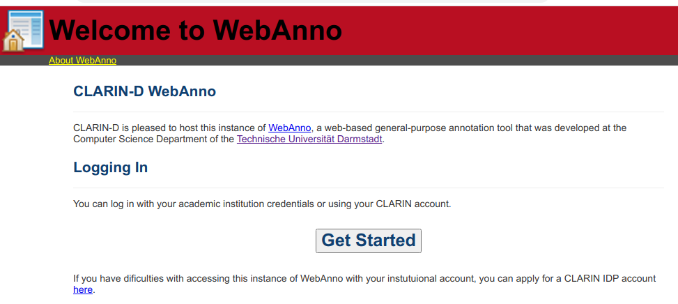
[[Startseite](https://webanno.sfs.uni-tuebingen.de/) der von der Universität Tübingen im Rahmen der CLARIAH / CLARIN-D-Infrastruktur gehosteten WebAnno-Instanz]

#### #### 4.4.2.2 Catma [(Gius u. a. 2020)](https://www.zotero.org/google-docs/?JpcNC3)

[CATMA](https://catma.de/) wurde ursprünglich für literaturwissenschaftliche Annotationen entwickelt und steht online
zur Verfügung. Es erlaubt kollaboratives Arbeiten ebenso wie die Erstellung eigener Annotationsschemata mit mehreren
Ebenen.

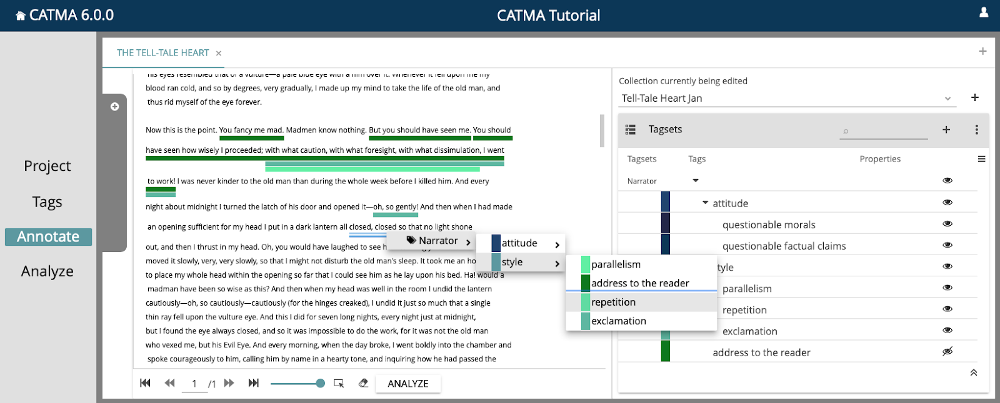
[Annotations-Editor in CATMA. Quelle: [CATMA-Tutorial](https://catma.de/how-to/tutorials/manual-annotation/)]

# 5 Literatur

Buchholz, Sabine; Marsi, Erwin (2006): „CoNLL-X shared task on multilingual dependency parsing“. In: Proceedings of the
tenth conference on computational natural language learning (CoNLL-X). New York City: Association for Computational
Linguistics, S. 149–164, Abgerufen am
von[ https://www.aclweb.org/anthology/W06-2920](https://www.aclweb.org/anthology/W06-2920)
[Allroggen, Gerhard (2011): „Carl-Maria-von-Weber-Gesamtausgabe. Digitale Edition,  (Version 4.3.0 vom 1. Februar 2021)“. Abgerufen am 30.08.2021 von http://weber-gesamtausgabe.de/A020001.](https://www.zotero.org/google-docs/?12LeVz)
[Baker, Paul (2006): „„The question is, how cruel is it?“ Keywords, Foxhunting and the House of Commons“. 2006.](https://www.zotero.org/google-docs/?12LeVz)
[Bender, Michael; Müller, Marcus (2020): „Heuristische Textpraktiken in den Wissenschaften: Eine kollaborative Annotationsstudie zum akademischen Diskurs“. In: ](https://www.zotero.org/google-docs/?12LeVz)*[Zeitschrift
für germanistische Linguistik](https://www.zotero.org/google-docs/?12LeVz)*[ 48(1), S.
1–46.](https://www.zotero.org/google-docs/?12LeVz)
[Bohnenkamp-Renken, Anne (2002): „A1 Neugermanistische Editionswissenschaft“. In: Gabler, Hans Walter; Bohnenkamp-Renken, Anne (Hrsg.): ](https://www.zotero.org/google-docs/?12LeVz)*[Kompendium
der Editionswissenschaft. Ein Handbuch zur historischen und systematischen Erschließung eines interdisziplinären
Gegenstands](https://www.zotero.org/google-docs/?12LeVz)*[. Online-Ausgabe., München: Universität
München.](https://www.zotero.org/google-docs/?12LeVz)
[Brinker, Klaus; Antos, Gerd; Heinemann, Wolfgang; u. a. (Hrsg.) (2000): ](https://www.zotero.org/google-docs/?12LeVz)*[Text-
und Gesprächslinguistik](https://www.zotero.org/google-docs/?12LeVz)*[. (= Handbücher zur Sprach- und
Kommunikationswissenschaft 16,1) Berlin [u.a.]: de Gruyter.](https://www.zotero.org/google-docs/?12LeVz)
[Brockman, William S.; Digital Library Federation (Hrsg.) (2001): ](https://www.zotero.org/google-docs/?12LeVz)*[Scholarly
work in the humanities and the evolving information environment](https://www.zotero.org/google-docs/?12LeVz)*[. (=
Optimizing collections and services for scholarly use) Washington, D.C: Digital Library Federation, Council on Library
and Information Resources.](https://www.zotero.org/google-docs/?12LeVz)
[Demmen, Jane Elizabeth; Culpeper, Jonathan Vaughan (2015): „Keywords“. In: Biber, Douglas; Reppen, Randi (Hrsg.): ](https://www.zotero.org/google-docs/?12LeVz)*[The
Cambridge Handbook of English Corpus Linguistics](https://www.zotero.org/google-docs/?12LeVz)*[. Cambridge University
Press, S. 90–105.](https://www.zotero.org/google-docs/?12LeVz)
[Deppermann, Arnulf (2008): ](https://www.zotero.org/google-docs/?12LeVz)*[Gespräche
analysieren](https://www.zotero.org/google-docs/?12LeVz)*[. (= Qualitative Sozialforschung 3) 4. Aufl., Wiesbaden: VS
Verl. für Sozialwiss.](https://www.zotero.org/google-docs/?12LeVz)
[Deppermann, Arnulf; Habscheid, Stephan; Hartung, Martin; u. a. (2000): „Editorial: Was ist und was will GESPRÄCHSFORSCHUNG? Eine neue Zeitschrift stellt sich vor“. In: ](https://www.zotero.org/google-docs/?12LeVz)*[Gesprächsforschung
- Online-Zeitschrift zur verbalen Interaktion](https://www.zotero.org/google-docs/?12LeVz)*[ 1(1), S.
1–8.](https://www.zotero.org/google-docs/?12LeVz)
[Eckart de Castilho, Richard; Biemann, Chris; Gurevych, Iryna; u. a. (2014): „WebAnno: a flexible, web-based annotation tool for CLARIN“. In: ](https://www.zotero.org/google-docs/?12LeVz)*[Proceedings
of the CLARIN annual conference (CAC) 2014](https://www.zotero.org/google-docs/?12LeVz)*[. Utrecht, Netherlands: CLARIN
ERIC, S. online, Citation Key: CLARIN-2014-WEBANNOpublisher-place: Soesterberg,
Netherlandstex.pdf: www.clarin.eu/sites/default/files/cac2014ₛubmission₆₀.pdf ](https://www.zotero.org/google-docs/?12LeVz)[blanktex.website: https://www.clarin.eu/content/papers-posters-and-demos-cac2014 (
Link: http://www.ukp.tu-darmstadt.de/ḧttps://www.clarin.eu/content/papers-posters-and-demos-cac2014̈ )
.](https://www.zotero.org/google-docs/?12LeVz)
[Eckart de Castilho, Richard; Mújdricza-Maydt, Éva; Yimam, Seid Muhie; u. a. (2016): „A web-based tool for the integrated annotation of semantic and syntactic structures“. In: ](https://www.zotero.org/google-docs/?12LeVz)*[Proceedings
of the workshop on language technology resources and tools for digital humanities (
LT4DH)](https://www.zotero.org/google-docs/?12LeVz)*[. Osaka, Japan: The COLING 2016 Organizing Committee, S. 76–84,
Abgerufen am von https://www.aclweb.org/anthology/W16-4011, Citation Key:
eckart-de-castilho-etal-2016-web.](https://www.zotero.org/google-docs/?12LeVz)
[Galinski, Agathe (2004): „Zweierlei Perspektiven auf Gespräche: Ethnomethodologische Konversationsanalyse und Diskursanalyse im kontrastiven Vergleich“. LINSE - Linguistik Server Essen.](https://www.zotero.org/google-docs/?12LeVz)
[Gius, Evelyn; Meister, Jan Christoph; Petris, Marco; u. a. (2020): ](https://www.zotero.org/google-docs/?12LeVz)*[CATMA](https://www.zotero.org/google-docs/?12LeVz)*[
. Zenodo.](https://www.zotero.org/google-docs/?12LeVz)
[Glück, Helmut; Rödel, Michael (Hrsg.) (2016): ](https://www.zotero.org/google-docs/?12LeVz)*[Metzler Lexikon
Sprache](https://www.zotero.org/google-docs/?12LeVz)*[. (= SpringerLink : Bücher) 5. Aufl., Stuttgart: J.B. Metzler,
Citation Key: UBHD-68045541 tex.library: UB.](https://www.zotero.org/google-docs/?12LeVz)
[Gries, Stefan Thomas (2009): „What is Corpus Linguistics?“. In: ](https://www.zotero.org/google-docs/?12LeVz)*[Language
and Linguistics Compass](https://www.zotero.org/google-docs/?12LeVz)*[ 3(5), S.
1–17.](https://www.zotero.org/google-docs/?12LeVz)
[Hinrichs, Erhard W.; Hinrichs, Marie; Zastrow, Thomas (2010): „WebLicht: Web-Based LRT Services for German“. In: ](https://www.zotero.org/google-docs/?12LeVz)*[Proceedings
of the ACL 2010 System Demonstrations](https://www.zotero.org/google-docs/?12LeVz)*[. S. 25–29, Abgerufen am
von http://www.aclweb.org/anthology/P10-4005.](https://www.zotero.org/google-docs/?12LeVz)
[IDS Mannheim (2014): ](https://www.zotero.org/google-docs/?12LeVz)*[Datenbank für gesprochenes Deutsch
DGD](https://www.zotero.org/google-docs/?12LeVz)*[.](https://www.zotero.org/google-docs/?12LeVz)
[MacWhinney, Brian (2000): ](https://www.zotero.org/google-docs/?12LeVz)*[The CHILDES Project: Tools for Analyzing
Talk.](https://www.zotero.org/google-docs/?12LeVz)*[ 3. Aufl., Mahwah, NJ: Lawrence Erlbaum
Associates.](https://www.zotero.org/google-docs/?12LeVz)
[MacWhinney, Brian; Wagner, Johannes (2010): „Transcribing, searching and data sharing: The CLAN software and the TalkBank data repository.“. In: ](https://www.zotero.org/google-docs/?12LeVz)*[Gesprächsforschung
- Online-Zeitschrift zur verbalen Interaktion](https://www.zotero.org/google-docs/?12LeVz)*[ (11), S.
154–173.](https://www.zotero.org/google-docs/?12LeVz)
[Meister, Jan Christoph (2015): „All dressed up and nowhere to go? The strategic role of digital humanities annotation tools“. Warburg-Haus, 30.10.2015.](https://www.zotero.org/google-docs/?12LeVz)
[National Information Standards Organization (U.S.) (2004): ](https://www.zotero.org/google-docs/?12LeVz)*[Understanding
metadata.](https://www.zotero.org/google-docs/?12LeVz)*[ Bethesda, MD: NISO
Press.](https://www.zotero.org/google-docs/?12LeVz)
[Neuroth, Heike; Neuroth, Heike; Rapp, Andrea; Söring, Sibylle (Hrsg.): (2015): „TextGrid: Von der Community - für die Community: Eine virtuelle Forschungsumgebung für die Geisteswissenschaften“. In: Düsseldorf ; vwh, W. Hülsbusch [Printversion] in Kooperation mit dem Universitätsverlag Göttingen [Onlineversion], S. 350 p.](https://www.zotero.org/google-docs/?12LeVz)
[Nutt-Kofoth, Rüdiger (2012): „Sichten – Perspektiven auf Text“. In: Bohnenkamp-Renken, Anne (Hrsg.): ](https://www.zotero.org/google-docs/?12LeVz)*[Medienwandel
/ Medienwechsel in der Editionswissenschaft](https://www.zotero.org/google-docs/?12LeVz)*[. Berlin, Boston: DE GRUYTER,
S. 19–29.](https://www.zotero.org/google-docs/?12LeVz)
[Plachta, Bodo (2013): ](https://www.zotero.org/google-docs/?12LeVz)*[Editionswissenschaft : Eine Einführung in Methode
und Praxis der Edition neuerer Texte](https://www.zotero.org/google-docs/?12LeVz)*[. (= Reclams universal-bibliothek
17603) 3. ergänzte und aktualisierte Auflage., Stuttgart: Reclam.](https://www.zotero.org/google-docs/?12LeVz)
[Rehbein, Jochen; Schmidt, Thomas; Meyer, Bernd; u. a. (2004): ](https://www.zotero.org/google-docs/?12LeVz)*[Handbuch
für das computergestütze Transkribieren nach HIAT](https://www.zotero.org/google-docs/?12LeVz)*[. (= Arbeiten zur
Mehrsprachigkeit - Folge B) Hamburg: Sonderforschungsbereich 538.](https://www.zotero.org/google-docs/?12LeVz)
[Schmidt, Thomas (2004): „EXMARaLDA - ein modellierungs- und visualisierungsverfahren für die computergestützte transkription gesprochener sprache“. In: Buchberger, Ernst (Hrsg.): ](https://www.zotero.org/google-docs/?12LeVz)*[Proceedings
of konvens 2004](https://www.zotero.org/google-docs/?12LeVz)*[. (= 5) Abgerufen am
von http://www.exmaralda.org/files/Konvens_Paper.pdf, Citation Key:
Schmidt2004.](https://www.zotero.org/google-docs/?12LeVz)
[Schmidt, Thomas; Kaiser, Julia (2016): „Einführung in die Benutzung der Ressourcen DGD und FOLK für gesprächsanalytische Zwecke. Handreichung: Einfache Recherche-Anfragen als Übungs-Beispiele“. IDS. Institut für deutsche Sprache Mannheim.](https://www.zotero.org/google-docs/?12LeVz)
[Schmunk, Stefan; Reiche, Ruth; Schöch, Christof; u. a.; Blümm, Mirjam; Schmunk, Stefan; Schöch, Christof (Hrsg.): (2014): „Verfahren der digital humanities in den geistes- und kulturwissenschaften“. In: ](https://www.zotero.org/google-docs/?12LeVz)*[DARIAH-DE
Working-Papers 4](https://www.zotero.org/google-docs/?12LeVz)*[ 4, S. 1–35, Citation Key:
article.](https://www.zotero.org/google-docs/?12LeVz)
[Seiffert, Hans Werner (2005): „Edition (1956/58)“. In: Nutt-Kofoth, Rüdiger (Hrsg.): ](https://www.zotero.org/google-docs/?12LeVz)*[Dokumente
zur Geschichte der neugermanistischen Edition](https://www.zotero.org/google-docs/?12LeVz)*[. (= Bausteine zur
Geschichte der Edition 1) Tübingen: Niemeyer, S. 162–173, collection-title: Bausteine zur Geschichte der
Edition.](https://www.zotero.org/google-docs/?12LeVz)
[Selting, Margret (1995): ](https://www.zotero.org/google-docs/?12LeVz)*[Prosodie im Gespräch: Aspekte einer
interaktionalen Phonologie der Konversation](https://www.zotero.org/google-docs/?12LeVz)*[. (= Linguistische Arbeiten
ARRAY(0x55d602f55848)) Tübingen: Zugl.: Oldenburg, Univ., Habil.-Schr.,
1991.](https://www.zotero.org/google-docs/?12LeVz)
[Selting, Margret; Auer, Peter; Deppermann, Arnulf; Hartung, Martin (Hrsg.): (2009): „Gesprächsanalytisches Transkriptionssystem 2 (GAT 2)“. In: ](https://www.zotero.org/google-docs/?12LeVz)*[Gesprächsforschung
- Online-Zeitschrift zur verbalen Interaktion](https://www.zotero.org/google-docs/?12LeVz)*[ (10), S.
353–402.](https://www.zotero.org/google-docs/?12LeVz)
[Sidnell, Jack (Hrsg.) (2013): ](https://www.zotero.org/google-docs/?12LeVz)*[The handbook of conversation
analysis](https://www.zotero.org/google-docs/?12LeVz)*[. (= Blackwell handbooks in linguistics) Malden, Mass.:
Wiley-Blackwell.](https://www.zotero.org/google-docs/?12LeVz)
[Stolz, Michael (2014): „Chretiens ,Roman de Perceval ou le Conte du Graal’ und Wolframs .Parzival’. Ihre Überlieferung und textkritische Erschließung“. In: Ridder, Klaus (Hrsg.): ](https://www.zotero.org/google-docs/?12LeVz)*[Wolframs
parzival-roman im europäischen kontext : Tübinger kolloqium 2012](https://www.zotero.org/google-docs/?12LeVz)*[. (=
Veröffentlichungen der wolfram-von-eschenbach-gesellschaft 23) Berlin.](https://www.zotero.org/google-docs/?12LeVz)
[Stolz, Michael (2021): „Parzival-Projekt. Wolfram von Eschenbach, ›Parzival‹.  Eine überlieferungskritische Ausgabe in digitaler Form.“. ](https://www.zotero.org/google-docs/?12LeVz)*[Parzival-Projekt](https://www.zotero.org/google-docs/?12LeVz)*[
Abgerufen am 30.08.2021 von https://www.parzival.unibe.ch/home.html.](https://www.zotero.org/google-docs/?12LeVz)
[Suphan, Bernhard (2005): „Vorreden zur Weimarer Goethe-Ausgabe, Bd. 1 (1887)“. In: Nutt-Kofoth, Rüdiger (Hrsg.): ](https://www.zotero.org/google-docs/?12LeVz)*[Dokumente
zur Geschichte der neugermanistischen Edition](https://www.zotero.org/google-docs/?12LeVz)*[. (= Bausteine zur
Geschichte der Edition 1) Tübingen: Niemeyer, collection-title: Bausteine zur Geschichte der
Edition.](https://www.zotero.org/google-docs/?12LeVz)
[Unsworth, John (2000): „Scholarly Primitives: what methods do humanities researchers have in common, and how might our tools reflect this?“. London, 13.5.2000.](https://www.zotero.org/google-docs/?12LeVz)
[Wittenburg, Peter; Brugman, Hennie; Russel, Albert; u. a. (2006): „ELAN: a professional framework for multimodality research“. In: ](https://www.zotero.org/google-docs/?12LeVz)*[Proceedings
of the fifth international conference on language resources and evaluation (
LREC’06)](https://www.zotero.org/google-docs/?12LeVz)*[. Genoa, Italy: European Language Resources Association (ELRA),
Abgerufen am von http://www.lrec-conf.org/proceedings/lrec2006/pdf/153ₚdf.pdf, Citation Key:
wittenburg-etal-2006-elan.](https://www.zotero.org/google-docs/?12LeVz)